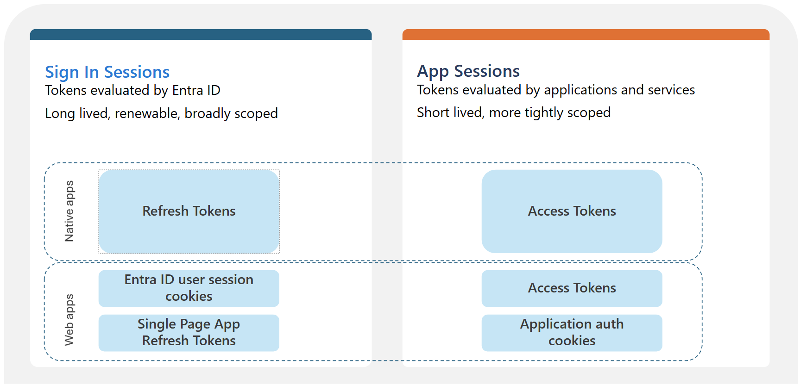

# Containment in Microsoft 365: the token problem

An analyst gets an adversary-in-the-middle (AiTM) alert on a user. They reset the password and disable the account, then call it contained. Twenty minutes later a sign-in from another country is still reading the mailbox, and a payment redirect is already in flight.

<!-- more -->

Nothing failed. The containment actions did what they were designed to do. The problem is that resetting the password and disabling the account targets the front door, and by the time you are responding the attacker is already inside holding a set of keys the front door lock never touches.

It is one of the most common containment mistakes in Microsoft 365 response, and the platform behaviour behind it is not obvious from the admin centre.

## How the attacker got in

Start with how they got in, because it decides what you are trying to contain. This is AiTM phishing. The attacker runs a reverse proxy between the victim and the real Microsoft login, relays the password and the multi-factor authentication (MFA) response to the genuine service in real time, and keeps the authenticated session that comes back. The victim does everything right and is genuinely signed in while the proxy copies the result.

Because the MFA challenge is relayed to the real identity provider (IdP) and satisfied there, SMS codes, time-based one-time password (TOTP) codes, and Authenticator push are all bypassed. They are shared secrets or approvals the proxy can pass through transparently. FIDO2, passkeys, and certificate-based auth resist this because the cryptographic response is bound to the real origin, and the authenticator refuses to sign for the attacker's proxy domain.

The tooling is commodity, with Evilginx2, Muraena, and Modlishka as the open-source frameworks. The phishing-as-a-service tier includes Tycoon 2FA, EvilProxy, Mamba 2FA, and Greatness. Tycoon 2FA, whose operator Microsoft tracks as Storm-1747, accounted for about 62 percent of the phishing Microsoft was blocking at its mid-2025 peak. A coordinated takedown in March 2026 by Microsoft's Digital Crimes Unit and Europol seized 330 domains.

## What a sign-in hands out

When a user authenticates to Entra ID, the sign-in issues more than one token. Microsoft's token documentation groups them into two families. The sign-in session, which is the refresh token, holds the signed-in state and is used to request access tokens. The app session, which is the access token, is what gets presented to a resource. That naming matters later, because the Revoke sessions action works on the sign-in session, meaning the refresh token.

*"Tokens evaluated by Microsoft Entra ID" by Microsoft, from [Microsoft Entra ID tokens](https://learn.microsoft.com/en-us/entra/identity/devices/concept-tokens-microsoft-entra-id), licensed under [CC BY 4.0](https://creativecommons.org/licenses/by/4.0/).*

The access token is the bearer credential the client presents to a resource such as Exchange Online or SharePoint. Bearer means whoever holds it can use it, with no check that they are the party it was issued to. The resource validates it on signature and expiry with no callback to Entra ID, so once issued it runs out its default one-hour lifetime.

The refresh token is long lived and silently mints new access tokens when the old one expires, and it is what Revoke sessions invalidates. Microsoft notes a small delay of a few minutes before that propagates, after which redeeming the token errors and the client is forced back to an interactive sign-in. A reset is the unreliable one, which the password reset section gets into.

In a browser, the sign-in session is held in the Entra `ESTSAUTH` cookie. This is the artifact AiTM steals. Replay it into another browser and you have an authenticated session that mints fresh tokens without re-doing MFA, because MFA was already satisfied when the victim signed in.

## Why disable and reset isn't enough

| Action | Refresh token | Session cookie | Access token | New sign-ins |
|---|---|---|---|---|
| Reset password | Flagged if password-based | Flagged if password-based | Runs to expiry, sooner with CAE | Allowed |
| Disable account | Blocks future redemption, no timestamp stamped | Not on its own | Runs to expiry, sooner with CAE | Blocked |
| Revoke sessions | Flagged, all of them | Flagged | Runs to expiry, sooner with CAE | Allowed |

Flagged means invalidated after a short propagation delay of a few minutes, not killed the instant you click. The access token column is the one to read first. Every action leaves it running, because the resource honours it on signature and expiry, barring Continuous Access Evaluation (CAE). Revoking the refresh token cuts off new access tokens, but the one already in hand keeps working for up to the hour it takes to expire.

Disabling the account is the one that trips people up. It blocks new interactive sign-ins and stops the disabled account redeeming a refresh token, but it does not terminate an active session or stop a live token. On its own it is the weakest of the three against an attacker who already has a session.

## What a password reset revokes

What a reset revokes depends on how the token was obtained.

There is one term to pin down, because it is easy to misread: password-based means the token came from a sign-in that used a password, and password plus MFA still counts. The second factor does not move you out of it. That covers every AiTM victim, because AiTM only works against a phishable password sign-in. Passwordless methods like FIDO2, passkeys and Windows Hello for Business defeat the attack outright, so they belong in the recommendations later, not here.

## Reset versus Revoke sessions

Microsoft's own emergency guidance shows which action it relies on, and for a cloud account it is not a password reset. For a Microsoft Entra environment, the Revoke user access in an emergency runbook is two steps: disable the account, then Revoke sessions. There is no cloud password reset in it. The only reset it lists is in the on-premises Active Directory section, a reset-twice step for pass-the-hash on the on-prem side, not the action that clears the cloud session.

So do not read the refresh-token revocation table as meaning a reset settles the AiTM case. The table shows a reset revokes the password-based token, but the action Microsoft's procedure uses to terminate the session is Revoke sessions. That matches what I saw in an incident, where disabling the account and resetting the password did not evict the actor, and access held until the sessions were explicitly revoked. Treat the tokens as persisting until you run Revoke sessions.

`Revoke-MgUserSignInSession`, the Revoke sessions action, stamps `signInSessionsValidFromDateTime` and invalidates the user's refresh tokens and cookies a few minutes after you run it. It still does not reach the live access token, and it does not touch the persistence the attacker planted outside the user's own credentials, which the next section covers.

## Persistence you have to remove by hand

Revoking the session addresses the stolen session. It does not address what the attacker did with it in the first ten minutes, and by the time you are containing they have usually already established something more durable. Session revocation does not touch any of the following, so each one has to be checked and pulled out by hand:

- OAuth application grants and consent. An attacker who registers or consents an app, or adds a client secret or certificate to an existing service principal, has access that survives the user's password, sessions, and often the account entirely. Audit app registrations, service principal credential additions, and consent grants around the compromise window.
- Inbox and transport rules. Auto-forwarding, rules that move security mail to a folder and mark it read, and delegate access granted to the attacker. Classic business email compromise (BEC) groundwork.
- Registered devices and MFA methods. A device joined during the session earns a Primary Refresh Token. A new authenticator registered by the attacker is standing MFA for them. Both persist past a session revoke.

## Order of operations

For a suspected AiTM or token-theft compromise in an Entra-only tenant, with the disable-then-revoke core from Microsoft's emergency access-revocation guidance:

1. **Disable the account.** Set `AccountEnabled` to false. Do this first. It is the fastest way to choke new token issuance, because a disabled account cannot complete a new sign-in and its refresh tokens fail at the next redemption. Once that propagates, nothing new is being minted while you work the rest, which is what makes the remaining order safe.
2. **Revoke sessions.** Run `Revoke-MgUserSignInSession`. Disable stops the account, and revoke clears what was already issued.
3. **Reset the password.** In a hybrid tenant, reset twice to cover the pass-the-hash window if there is any doubt the on-prem side is clean, and account for Entra Connect sync lag. Run the reset in the Entra or Microsoft 365 admin centre.
4. **Hunt and pull the persistence from the section above.** OAuth grants, credentials on service principals, inbox rules, registered devices and MFA methods. This is the part that removes the attacker's foothold, and none of steps 1 to 3 reach it.
5. **Accept the access-token window.** A live access token the attacker already holds runs toward its expiry. On the CAE-capable Microsoft 365 workloads, which have it on by default, a revoke cuts it within about fifteen minutes; elsewhere it runs up to the hour. Plan comms and monitoring around that window.

`Revoke-MgUserSignInSession` is the current Graph cmdlet. The old AzureAD and MSOnline modules are deprecated, so anything you put in a runbook should be Graph based.

## Limiting what a stolen token can do

Containment is what you do after the fact. These posture controls decide how much a stolen token buys the attacker in the first place, and they are where the client conversation belongs.

The strongest controls bind access to something the attacker does not have. Requiring a compliant or managed device in Conditional Access means a replayed cookie fails when the attacker tries to use it from their own machine, because the device requirement cannot be met off a registered endpoint. Credentials and cookies can be stolen, but a device-bound check cannot be satisfied from a machine the attacker controls.

The Global Secure Access (GSA) compliant-network condition does the same job at the network layer without you managing IP lists. It blocks token acquisition for cloud apps unless the client is coming through your GSA tenant, so an attacker replaying from their own infrastructure is refused. The Naunheim and Lamppu playbook puts both of these ahead of location-based controls.

Licensing reality for any client-facing version. Conditional Access needs Entra ID P1, and P2 for the risk-based pieces. Device compliance and GSA each carry their own product licensing on top, Intune for compliance and the Entra Suite for GSA. Confirm what the tenant actually has before you recommend any of it.

## The durable fix and the limits

Everything above is incident response. The recommendation that removes the attack instead of shrinking its blast radius is phishing-resistant MFA, meaning FIDO2 security keys, passkeys, or Windows Hello for Business, enforced through Conditional Access for the accounts that matter first, your privileged users and the staff AiTM crews target most. Origin binding is what breaks the reverse proxy, because the authenticator refuses to sign for the attacker's proxy domain. Put it in the same recommendation set as the device and network controls above. Those limit what a replayed token can reach, and phishing-resistant sign-in removes the replay at the source.

Token protection, which binds a token to the client device so a stolen token is useless elsewhere, is the direction the platform is moving and is worth tracking. Check its current availability and supported client and resource coverage before you build a recommendation on it, because that coverage has been narrow and changing.

One limitation to state honestly in any report: Entra cannot directly revoke a session token that an application issued. A third-party software-as-a-service (SaaS) app federated through Entra that holds its own session will keep honouring it on its own schedule, and only deprovisioning or the app's own controls reach that, at the app's pace.

## References

**Microsoft primary sources**

- [Understanding tokens in Microsoft Entra ID](https://learn.microsoft.com/en-us/entra/identity/devices/concept-tokens-microsoft-entra-id). The two token families, the token type table, and token theft vectors.
- [Refresh tokens in the Microsoft identity platform](https://learn.microsoft.com/en-us/entra/identity-platform/refresh-tokens). The token revocation table, refresh-token lifetimes, and revocation behaviour.
- [Revoke user access in an emergency in Microsoft Entra ID](https://learn.microsoft.com/en-us/entra/identity/users/users-revoke-access). The cloud procedure of disable then Revoke sessions, the on-prem reset-twice step, and the window before access actually ends.
- [Continuous access evaluation in Microsoft Entra](https://learn.microsoft.com/en-us/entra/identity/conditional-access/concept-continuous-access-evaluation). CAE's default critical-event behaviour and its near-real-time revocation window.
- [How a global coalition disrupted Tycoon 2FA, Microsoft On the Issues](https://blogs.microsoft.com/on-the-issues/2026/03/04/how-a-global-coalition-disrupted-tycoon/). The March 2026 takedown, the 330 domains, and Tycoon 2FA's scale.

**Community and research**

- [AzureAD-Attack-Defense: Adversary-in-the-Middle, by Sami Lamppu and Thomas Naunheim](https://github.com/Cloud-Architekt/AzureAD-Attack-Defense/blob/main/Adversary-in-the-Middle.md). AiTM mechanics, device-compliance and Global Secure Access mitigations, and phishing-resistant MFA.
- [Tycoon 2FA AiTM detection engineering, Elastic Security Labs](https://www.elastic.co/security-labs/tycoon-2fa-aitm-detection-engineering). Tycoon 2FA tradecraft, Storm-1747 attribution, and takedown context.
