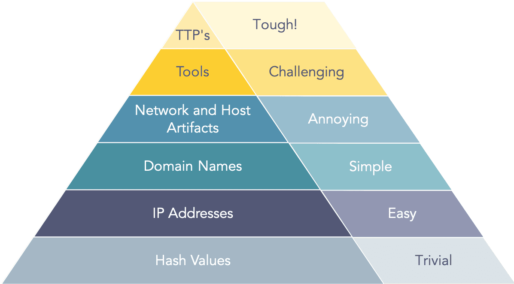
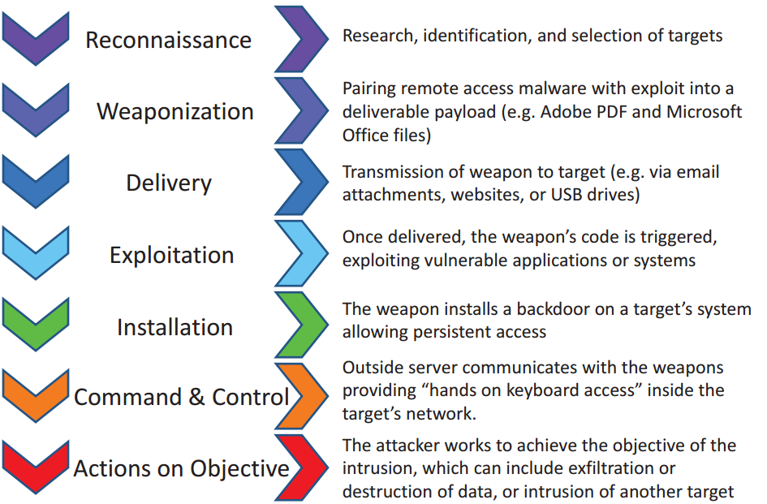
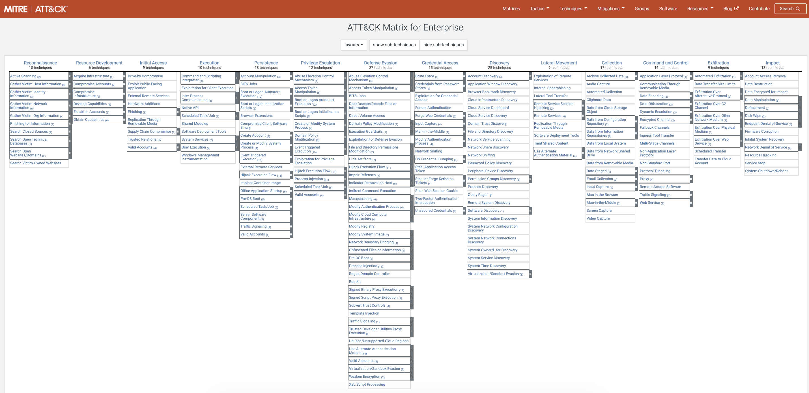
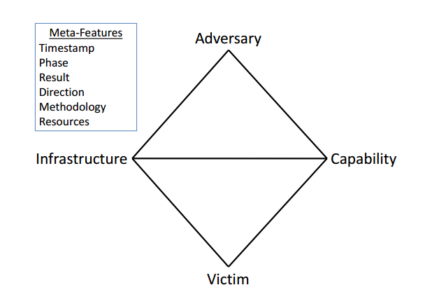
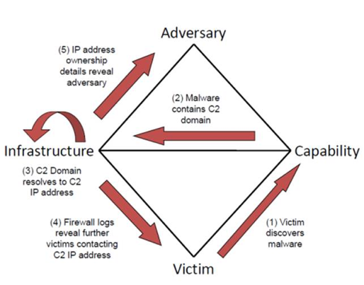
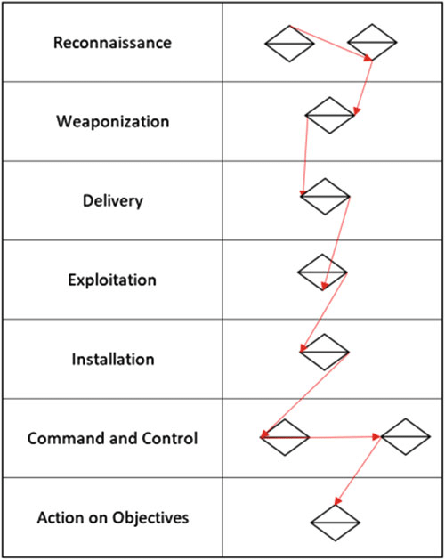

# Threat Intelligence & Intrusion Analysis

## Threat Intelligence

Threat Intelligence is information about threats, threat actors and indicators of compromise that assist cybersecurity teams and individuals prepare against attacks, understand trends and what tactics threat actors used or are currently using&#x20;

## Threat Intelligence Feeds

There are numerous threat intelligence feeds available for you to use and one of the ones I would recommend is [Alien Vault OTX (Open Threat Exchange)](https://otx.alienvault.com/). It provides members of the community to create their own "pulses" which contain indicators such as hashes, domains, URL's, hostnames and more.&#x20;

Furthermore, you can easily filter for specific indicators you are interested in and follow other users "pulses". Of course, this is a rough summary so as recommended go check it out, create a profile and start exploring.

A suggestion is to google "threat intelligence feeds" to find more and identify which ones you find most helpful and up-to-date.

## Types of indicators

What are IoC's vs IoA's and how do we use them to better protect our systems?

### Indicators of Compromise (IoC)

IoC's can be thought of as reactive indicators. They are pieces of forensic data that tell us malicious activity that has occurred on a system and are found after an attack has occurred.&#x20;

IoC's can be used by organisations for protecting themselves against future attacks by hunting for IoC's on their systems. IoC's are can be found from multiple sources which allow for organisations to monitor for these indicators and stop the attack chain to minimise or prevent damage from occurring.

### Indicators of Attack (IoA)

While similar to IoC's an IoA can be thought of as a proactive indicator. They are pieces of information that exhibit malicious activity is currently occurring on a system. These indicators can allow defenders to work out what is happening on the system during an attack and why.

## The Pyramid of Pain

The Pyramid of Pain was developed by [David Bianco](https://www.linkedin.com/in/davidjbianco/) to highlight the difference in IoC's. The difference being twofold.&#x20;

1. How different artifacts increase in difficulty to identify and prevent
2. How different artifacts increase in difficulty for attackers to adapt

### What does this mean?

As someone defending against the attackers, it is easy for us to run hash-based IoC's across our system to identify if there are any malicious files present.

On the other hand, an attacker changing the hash value of a malicious file so that it can evade signature-based antivirus software is easy. All it takes is the code to be adjusted creating a unique file that hasn't been seen before.

Moving to the top of the pyramid are Tactics, Techniques and Procedures (TTP's). These are difficult for defenders to detect, one because different adversaries use different TTP's and these do change over time.

On the other hand, it is difficult for attackers to change their TTP's as it takes **time**, **effort** and **resources** but the payoff is worth it. We will talk later about this last sentence in the "The Cyber Kill Chain" section.

## The Cyber Kill Chain

[The Cyber Kill Chain](https://www.lockheedmartin.com/en-us/capabilities/cyber/cyber-kill-chain.html) was created by Lockheed Martin to identify what stages an adversary will take and complete to achieve its objectives.

If defenders can break the chain this can be enough to stop an attack but, further to this is the **time**, **effort** and **resources** it takes for adversaries to complete these phases. If defenders can slow down attackers or prevent them from progressing it may be not worth the adversaries efforts to continue as there are easier targets available for them to successfully achieve their objectives through.

### What about the MITRE ATT\&CK framework?

The [MITRE ATT\&CK ](https://attack.mitre.org/)is a framework that is my personal go-to because of the brilliant resources provided by The MITRE Corporation. It provides not only the high-level tactics but also the techniques that each phase of an attack may use. MITRE are actively updating the techniques as they appear in the wild which add's to it's value.

Understanding both of them will only deepen your knowledge.

Using the MITRE ATT\&CK framework when conducting forensic reporting is helpful to be able to explain how different artifacts showcase what tactic and technique an adversary used to achived objectives.

### New addition MITRE D3FEND

**Not strictly threat intelligence or intrusion analysis, this is good to know about regardless and seeing as we are talking about MITRE why not add it in.**

Recently released by The MITRE Corportation was the [MITRE DEF3ND framework](https://d3fend.mitre.org/). This framework works in the opposite to the ATT\&K framework by highlighting the countermeasures that teams can use to protect their organisations.&#x20;

## The Diamond Model of Intrusion Analysis

The Diamond Model of Intrusion Analysis is used by cyber-security analysts to model how an **Adversary** uses a **Capability** from their **Infrastructure** to attack a **Victim** as well as the TTP's used. The meta-features are extra information that can be added to provide context to the order of activities and other critical details.

Examples of what details relate to the **Adversary:**

* Location
* IP address
* Network assets
* Persona i.e. criminal, hacktivist, APT etc

&#x20;Examples of what details relate to the **Capability:**

* Malware
* Exploits
* Stolen or fraudulent certificates
* TTP's

&#x20;Examples of what details relate to the **Infrastructure:**

* IP addresses
* Domains
* Email addresses

&#x20;Examples of what details relate to the **Victim:**

* Organsation
* Network assets
* Website

Typically we don't just see one event occurring during an incident but multiple and the diagram can be used to chain diamonds together to highlight how the attack flowed and evolved as time goes on.

In the diagram below we can see an example of how the diamond works when an attack is modelled against it. Meta-features have been added to show the flow of activities and what occurs at each stage.

The above diagram is a simple use of just one diamond being utilised but attacks are rarely simple enough to show everything that has occurred on one diamond. The below diagram shows how one could chain these diamonds together and add meta-features that this diagram doesn't show would tell a clear story of what occurred.&#x20;

This can process can become more complex by identifying other potential paths the attacker could have taken but I'll let you research and dig into this a bit more on your own.

## Conclusion

The topics covered above will give you a stronger understanding of how attacks can be detected through the use of IoC's and IoA's as well as threat intelligence feeds. We have also looked into the chain of events that attackers want to complete to achieve their objectives as well as how we can model these events after the fact. I recommend taking a look at the references below to continue to dig deeper and expand your knowledge.

## _References_














