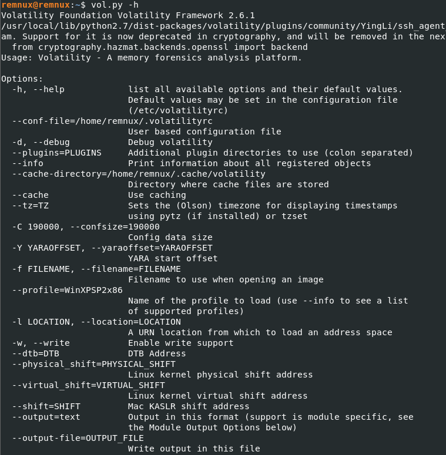

# Part 1: Memory and Volatility

The [_Australian Cyber Security Centre_](https://www.cyber.gov.au/) released a "simulated cyber security challenge" which was first used at a security conference called [_BSides Canberra_](https://www.bsidesau.com.au/) 2021. It is an awesome challenge to have a go at and provides questions and answers so you can test your knowledge. The challenge can be found [_here_](https://www.cyber.gov.au/acsc/view-all-content/news/acsc-cyber-security-challenge)_._

We will examine the memory file provided in the challenge using Volatility. In doing so, we will explore the functionality and features of Volatility that can be used when examining memory files in an incident response engagement.

## What is RAM?

Random Access Memory, or RAM, is the memory that a computer uses to temporarily write information it has read from the hard disk so that it can use it quickly when required, resulting in a faster user experience as RAM is very quick compared to the read/write speeds of a hard disk.

For example, you may have noticed when running Google Chrome that if you look at the task manager, Chrome tends to use a lot of RAM. This is because Chrome uses the RAM to store information related to running the program. The specifics of why it uses so much? I'm not sure but many a joke has been had as a result.


As mentioned above RAM is only temporary storage, or what we refer to as volatile, meaning that when the computer is turned off, the RAM is erased too.

## Why is RAM important to investigate?

When responding to an incident, RAM can be extremely useful in identifying artifacts relating to the attack and the actor involved.

It is important to consider if you are able to do a RAM dump (copy the contents of RAM) when dealing with a live system (hasn't been turned off).

## Memory Analysis with Volatility

One of the commonly used tools for examining RAM is called [_Volatility_](https://www.volatilityfoundation.org/) created by The Volatility Foundation. It can be run on Windows, Linux or Mac operating systems adding to its usefulness and ease of use.

Let's take a look at how we would examine a RAM dump using Volatility. I will be using [_REMnux_](https://remnux.org/)_,_ a Linux distro created by [_Lenny Zeltser_](https://zeltser.com/) for malware analysis but includes tools such as volatility and doesn't require much setup.

_Note: Some of the output from volatility in this article is lengthy but I believe it is a good habit to view what the output will look like if you were to be conducting memory analysis yourself and adjust to the output produced._&#x20;

### Volatility Overview in the terminal

When first looking at volatility, we can use the command "vol.py -h" shown in the snip below to identify what its features, arguments and plugins are.



All Volatility commands are based on the same command and only vary depending on the plugin you use which will determine if you are required to provide other arguments.

```
vol.py -f [image] profile=[profile] [plugin]
```

### Volatility Profiles

Our first question is what version of Windows was in use when the RAM was captured? We need to know this to apply the correct 'profile' in Volatility for it to correctly parse the memory dump.

The below command can be used to identify what profiles are supported in the version of Volatility you are using.

```
vol.py --info | more
```

The output of this command for Volatility 2.6.1 at the time of writing this article are outlined below and as we can see there is good support from Windows XP through to Windows 10.

```
VistaSP0x64           - A Profile for Windows Vista SP0 x64
VistaSP0x86           - A Profile for Windows Vista SP0 x86
VistaSP1x64           - A Profile for Windows Vista SP1 x64
VistaSP1x86           - A Profile for Windows Vista SP1 x86
VistaSP2x64           - A Profile for Windows Vista SP2 x64
VistaSP2x86           - A Profile for Windows Vista SP2 x86
Win10x64              - A Profile for Windows 10 x64
Win10x64_10240_17770  - A Profile for Windows 10 x64 (10.0.10240.17770 / 2018-02-10)
Win10x64_10586        - A Profile for Windows 10 x64 (10.0.10586.306 / 2016-04-23)
Win10x64_14393        - A Profile for Windows 10 x64 (10.0.14393.0 / 2016-07-16)
Win10x64_15063        - A Profile for Windows 10 x64 (10.0.15063.0 / 2017-04-04)
Win10x64_16299        - A Profile for Windows 10 x64 (10.0.16299.0 / 2017-09-22)
Win10x64_17134        - A Profile for Windows 10 x64 (10.0.17134.1 / 2018-04-11)
Win10x64_17763        - A Profile for Windows 10 x64 (10.0.17763.0 / 2018-10-12)
Win10x64_18362        - A Profile for Windows 10 x64 (10.0.18362.0 / 2019-04-23)
Win10x64_19041        - A Profile for Windows 10 x64 (10.0.19041.0 / 2020-04-17)
Win10x86              - A Profile for Windows 10 x86
Win10x86_10240_17770  - A Profile for Windows 10 x86 (10.0.10240.17770 / 2018-02-10)
Win10x86_10586        - A Profile for Windows 10 x86 (10.0.10586.420 / 2016-05-28)
Win10x86_14393        - A Profile for Windows 10 x86 (10.0.14393.0 / 2016-07-16)
Win10x86_15063        - A Profile for Windows 10 x86 (10.0.15063.0 / 2017-04-04)
Win10x86_16299        - A Profile for Windows 10 x86 (10.0.16299.15 / 2017-09-29)
Win10x86_17134        - A Profile for Windows 10 x86 (10.0.17134.1 / 2018-04-11)
Win10x86_17763        - A Profile for Windows 10 x86 (10.0.17763.0 / 2018-10-12)
Win10x86_18362        - A Profile for Windows 10 x86 (10.0.18362.0 / 2019-04-23)
Win10x86_19041        - A Profile for Windows 10 x86 (10.0.19041.0 / 2020-04-17)
Win2003SP0x86         - A Profile for Windows 2003 SP0 x86
Win2003SP1x64         - A Profile for Windows 2003 SP1 x64
Win2003SP1x86         - A Profile for Windows 2003 SP1 x86
Win2003SP2x64         - A Profile for Windows 2003 SP2 x64
Win2003SP2x86         - A Profile for Windows 2003 SP2 x86
Win2008R2SP0x64       - A Profile for Windows 2008 R2 SP0 x64
Win2008R2SP1x64       - A Profile for Windows 2008 R2 SP1 x64
Win2008R2SP1x64_23418 - A Profile for Windows 2008 R2 SP1 x64 (6.1.7601.23418 / 2016-04-09)
Win2008R2SP1x64_24000 - A Profile for Windows 2008 R2 SP1 x64 (6.1.7601.24000 / 2016-04-09)
Win2008SP1x64         - A Profile for Windows 2008 SP1 x64
Win2008SP1x86         - A Profile for Windows 2008 SP1 x86
Win2008SP2x64         - A Profile for Windows 2008 SP2 x64
Win2008SP2x86         - A Profile for Windows 2008 SP2 x86
Win2012R2x64          - A Profile for Windows Server 2012 R2 x64
Win2012R2x64_18340    - A Profile for Windows Server 2012 R2 x64 (6.3.9600.18340 / 2016-05-13)
Win2012x64            - A Profile for Windows Server 2012 x64
Win2016x64_14393      - A Profile for Windows Server 2016 x64 (10.0.14393.0 / 2016-07-16)
Win7SP0x64            - A Profile for Windows 7 SP0 x64
Win7SP0x86            - A Profile for Windows 7 SP0 x86
Win7SP1x64            - A Profile for Windows 7 SP1 x64
Win7SP1x64_23418      - A Profile for Windows 7 SP1 x64 (6.1.7601.23418 / 2016-04-09)
Win7SP1x64_24000      - A Profile for Windows 7 SP1 x64 (6.1.7601.24000 / 2018-01-09)
Win7SP1x86            - A Profile for Windows 7 SP1 x86
Win7SP1x86_23418      - A Profile for Windows 7 SP1 x86 (6.1.7601.23418 / 2016-04-09)
Win7SP1x86_24000      - A Profile for Windows 7 SP1 x86 (6.1.7601.24000 / 2018-01-09)
Win81U1x64            - A Profile for Windows 8.1 Update 1 x64
Win81U1x86            - A Profile for Windows 8.1 Update 1 x86
Win8SP0x64            - A Profile for Windows 8 x64
Win8SP0x86            - A Profile for Windows 8 x86
Win8SP1x64            - A Profile for Windows 8.1 x64
Win8SP1x64_18340      - A Profile for Windows 8.1 x64 (6.3.9600.18340 / 2016-05-13)
Win8SP1x86            - A Profile for Windows 8.1 x86
WinXPSP1x64           - A Profile for Windows XP SP1 x64
WinXPSP2x64           - A Profile for Windows XP SP2 x64
WinXPSP2x86           - A Profile for Windows XP SP2 x86
WinXPSP3x86           - A Profile for Windows XP SP3 x86
```

In our case, as we haven't created the RAM dump and as such we do not know what version of Windows the computer was using, the challenge provides us with the profile 'Win10x64\_17134'.

Fortunately, if for some reason or other we didn't know what version of Windows the RAM dump came from then we can use the below command to ask Volatility to attempt to identify the version.

```
vol.py -f <path to image> imageinfo
```

This can take time in some cases but below is the snipped output from the terminal. As we can see the first suggested profile is 'Win10x64\_17134'. Therefore a good bet is to try that profile first and work your way through the other suggestions if the first doesn't work.

```
Suggested Profile(s) : Win10x64_17134, Win10x64_14393, Win10x64_10586, Win10x64_16299, Win2016x64_14393, Win10x64_17763, Win10x64_15063 (Instantiated with Win10x64_15063)
```

### Process Plugins

One of the process plugins I find most useful to start analysing is 'pstree'. This plugin allows you to view the processes running on the device at the time of capture in a tree format showing the parent-child relationships between processes, their Process ID (PID) and time of execution. The output of this command can be lengthy depending on how many processes are running. So, let's have a look and see if anything piques our interest.

```
vol.py -f ~/Volatility-Sleuthifer/memory.raw --profile=Win10x64_17134 pstree
Volatility Foundation Volatility Framework 2.6.1

Name                                                  Pid   PPid   Thds   Hnds Time
-------------------------------------------------- ------ ------ ------ ------ ----
 0xffffac81901ee080:wininit.exe                       632    548      1      0 2021-04-01 05:05:00 UTC+0000
. 0xffffac8190e52100:services.exe                     768    632      7      0 2021-04-01 05:05:01 UTC+0000
.. 0xffffac8191485080:svchost.exe                    2560    768      6      0 2021-04-01 05:05:03 UTC+0000
.. 0xffffac81914db0c0:spoolsv.exe                    2588    768     15      0 2021-04-01 05:05:03 UTC+0000
.. 0xffffac819112b080:svchost.exe                    4128    768      4      0 2021-04-01 05:48:24 UTC+0000
... 0xffffac81927a90c0:TabTip.exe                    4680   4128     11      0 2021-04-01 05:48:25 UTC+0000
.... 0xffffac8192727080:TabTip32.exe                 4756   4680      1      0 2021-04-01 05:48:25 UTC+0000
... 0xffffac81914e9080:ctfmon.exe                    4192   4128      8      0 2021-04-01 05:48:24 UTC+0000
... 0xffffac81928ca080:TabTip.exe                    3964   4128      0 ------ 2021-04-06 01:56:26 UTC+0000
.. 0xffffac8191feb340:svchost.exe                    1456    768      2      0 2021-04-01 05:48:24 UTC+0000
.. 0xffffac819169b080:svchost.exe                    3112    768     13      0 2021-04-01 05:05:04 UTC+0000
.. 0xffffac819120c080:svchost.exe                    2396    768     10      0 2021-04-01 05:05:03 UTC+0000
.. 0xffffac819139b380:svchost.exe                    2092    768      5      0 2021-04-01 05:05:03 UTC+0000
.. 0xffffac819101f340:svchost.exe                    1092    768     40      0 2021-04-01 05:05:02 UTC+0000
... 0xffffac8191f8d2c0:rdpclip.exe                   2392   1092     10      0 2021-04-01 05:48:23 UTC+0000
.... 0xffffac81927570c0:rdpinput.exe                 4628   2392      4      0 2021-04-01 05:48:25 UTC+0000
.. 0xffffac8191204340:svchost.exe                    1612    768      5      0 2021-04-01 05:05:03 UTC+0000
.. 0xffffac81901f4080:msdtc.exe                      1104    768      9      0 2021-04-01 05:07:04 UTC+0000
.. 0xffffac8190f8d2c0:svchost.exe                     624    768      7      0 2021-04-01 05:05:02 UTC+0000
... 0xffffac8190e21080:winlogon.exe                   700    624      2      0 2021-04-01 05:05:00 UTC+0000
.... 0xffffac8191005100:LogonUI.exe                   512    700     10      0 2021-04-01 05:05:02 UTC+0000
.... 0xffffac819100f080:dwm.exe                      1028    700     12      0 2021-04-01 05:05:02 UTC+0000
.... 0xffffac8190f2f200:fontdrvhost.ex                960    700      5      0 2021-04-01 05:05:01 UTC+0000
... 0xffffac81901f3140:csrss.exe                      640    624      9      0 2021-04-01 05:05:00 UTC+0000
.. 0xffffac81912372c0:svchost.exe                    1660    768      4      0 2021-04-01 05:05:03 UTC+0000
.. 0xffffac8194af2080:svchost.exe                     652    768     11      0 2021-04-05 21:59:50 UTC+0000
.. 0xffffac8191238080:svchost.exe                    1668    768      6      0 2021-04-01 05:05:03 UTC+0000
.. 0xffffac8191053340:svchost.exe                    1164    768      3      0 2021-04-01 05:05:02 UTC+0000
.. 0xffffac819123a700:svchost.exe                    1680    768      9      0 2021-04-01 05:05:03 UTC+0000
.. 0xffffac819267c2c0:svchost.exe                    1688    768      7      0 2021-04-01 05:48:24 UTC+0000
.. 0xffffac8191058700:svchost.exe                    1180    768      4      0 2021-04-01 05:05:02 UTC+0000
.. 0xffffac81914e2080:amazon-ssm-age                 2728    768     13      0 2021-04-01 05:05:03 UTC+0000
... 0xffffac818dea2080:ssm-agent-work                3992   2728     13      0 2021-04-01 05:05:09 UTC+0000
.... 0xffffac8191997080:conhost.exe                  4004   3992      4      0 2021-04-01 05:05:09 UTC+0000
.. 0xffffac8192630080:svchost.exe                    6828    768      3      0 2021-04-06 01:30:54 UTC+0000
.. 0xffffac81912502c0:svchost.exe                    1712    768      4      0 2021-04-01 05:05:03 UTC+0000
.. 0xffffac8191225080:svchost.exe                    2848    768      2      0 2021-04-01 05:05:04 UTC+0000
.. 0xffffac819298f080:svchost.exe                    4292    768      1      0 2021-04-01 05:58:48 UTC+0000
.. 0xffffac8191546080:LiteAgent.exe                  2768    768      2      0 2021-04-01 05:05:03 UTC+0000
.. 0xffffac8191542080:svchost.exe                    2784    768      7      0 2021-04-01 05:05:04 UTC+0000
.. 0xffffac8191370340:svchost.exe                    1260    768      7      0 2021-04-01 05:05:03 UTC+0000
.. 0xffffac8191089380:svchost.exe                    1264    768      6      0 2021-04-01 05:05:02 UTC+0000
.. 0xffffac81911b4340:svchost.exe                    1576    768     12      0 2021-04-01 05:05:03 UTC+0000
.. 0xffffac8191034300:svchost.exe                    1152    768      2      0 2021-04-01 05:05:02 UTC+0000
.. 0xffffac818d508080:svchost.exe                    2336    768      7      0 2021-04-01 05:05:03 UTC+0000
... 0xffffac8191fe82c0:sihost.exe                    1956   2336     14      0 2021-04-01 05:48:24 UTC+0000
.. 0xffffac818d4f2080:svchost.exe                    2352    768      5      0 2021-04-01 05:05:03 UTC+0000
.. 0xffffac8191ff32c0:svchost.exe                    1328    768      7      0 2021-04-01 05:48:24 UTC+0000
.. 0xffffac81912c4340:svchost.exe                    1848    768     11      0 2021-04-01 05:05:03 UTC+0000
.. 0xffffac819198c080:NisSrv.exe                     3904    768      4      0 2021-04-01 05:05:06 UTC+0000
.. 0xffffac81915d5080:svchost.exe                    2956    768      3      0 2021-04-01 05:05:04 UTC+0000
.. 0xffffac8191616080:svchost.exe                    2896    768      3      0 2021-04-01 05:05:04 UTC+0000
.. 0xffffac81910c4080:svchost.exe                    6484    768     11      0 2021-04-06 01:56:17 UTC+0000
.. 0xffffac8191614080:svchost.exe                    2904    768      6      0 2021-04-01 05:05:04 UTC+0000
.. 0xffffac818d503080:svchost.exe                    1884    768      5      0 2021-04-01 05:07:07 UTC+0000
.. 0xffffac81912e22c0:svchost.exe                    1888    768     10      0 2021-04-01 05:05:03 UTC+0000
... 0xffffac819262c340:taskhostw.exe                 2236   1888      6      0 2021-04-01 05:48:24 UTC+0000
.. 0xffffac8190e50080:svchost.exe                    1384    768      7      0 2021-04-01 05:05:03 UTC+0000
.. 0xffffac8190e82080:svchost.exe                    7032    768      5      0 2021-04-02 01:20:04 UTC+0000
.. 0xffffac819163e080:svchost.exe                    2964    768      7      0 2021-04-01 05:05:04 UTC+0000
.. 0xffffac8191055380:svchost.exe                    1172    768      4      0 2021-04-01 05:05:02 UTC+0000
.. 0xffffac819132b340:svchost.exe                    1924    768      6      0 2021-04-01 05:05:03 UTC+0000
.. 0xffffac8190076080:svchost.exe                     908    768      1      0 2021-04-01 05:05:01 UTC+0000
.. 0xffffac8191333080:svchost.exe                    2456    768      6      0 2021-04-01 05:05:03 UTC+0000
.. 0xffffac8190f182c0:svchost.exe                     928    768     17      0 2021-04-01 05:05:01 UTC+0000
... 0xffffac819270d080:dllhost.exe                    560    928      8      0 2021-04-01 05:49:08 UTC+0000
... 0xffffac8192d36080:RuntimeBroker.                1588    928      6      0 2021-04-01 05:48:43 UTC+0000
... 0xffffac8192b56080:RuntimeBroker.                5688    928     13      0 2021-04-01 05:48:32 UTC+0000
... 0xffffac81933eb740:smartscreen.ex                5184    928      8      0 2021-04-06 01:56:17 UTC+0000
... 0xffffac8192ae9080:SearchUI.exe                  5588    928     39      0 2021-04-01 05:48:32 UTC+0000
... 0xffffac8192d3a080:dllhost.exe                   5772    928      7      0 2021-04-06 01:56:58 UTC+0000
... 0xffffac8192a82080:ShellExperienc                5504    928     27      0 2021-04-01 05:48:31 UTC+0000
... 0xffffac8193cea080:backgroundTask                 904    928      8      0 2021-04-06 01:56:18 UTC+0000
... 0xffffac8191fc2080:RuntimeBroker.                5620    928      5      0 2021-04-01 05:48:32 UTC+0000
... 0xffffac8192685080:wsmprovhost.ex                4076    928     15      0 2021-04-06 01:02:25 UTC+0000
.... 0xffffac81958dd080:PSclient.exe                   32   4076      5      0 2021-04-06 01:02:26 UTC+0000
..... 0xffffac81959d6080:conhost.exe                 3064     32      4      0 2021-04-06 01:02:26 UTC+0000
.. 0xffffac8190f6f340:svchost.exe                     496    768     12      0 2021-04-01 05:05:02 UTC+0000
.. 0xffffac8191ff0080:svchost.exe                    2196    768      4      0 2021-04-02 01:20:04 UTC+0000
.. 0xffffac81915d6080:svchost.exe                    2472    768     19      0 2021-04-01 05:07:04 UTC+0000
.. 0xffffac8192615340:svchost.exe                    2716    768      4      0 2021-04-01 05:48:24 UTC+0000
.. 0xffffac8190f71080:svchost.exe                    4012    768      9      0 2021-04-01 05:07:05 UTC+0000
.. 0xffffac81929ce080:svchost.exe                    4140    768      5      0 2021-04-01 05:48:28 UTC+0000
.. 0xffffac8191638080:MsMpEng.exe                    2992    768     29      0 2021-04-01 05:05:04 UTC+0000
.. 0xffffac8191138340:svchost.exe                    1476    768      3      0 2021-04-01 05:05:03 UTC+0000
.. 0xffffac8191347300:svchost.exe                    2004    768      4      0 2021-04-01 05:05:03 UTC+0000
.. 0xffffac819168d080:svchost.exe                    3036    768      2      0 2021-04-01 05:05:04 UTC+0000
.. 0xffffac8192760080:svchost.exe                    4500    768      4      0 2021-04-01 05:48:25 UTC+0000
.. 0xffffac81910d0340:svchost.exe                    1312    768     11      0 2021-04-01 05:05:02 UTC+0000
.. 0xffffac81913642c0:svchost.exe                    2032    768      5      0 2021-04-01 05:05:03 UTC+0000
.. 0xffffac819105c380:svchost.exe                    1192    768      4      0 2021-04-01 05:05:02 UTC+0000
.. 0xffffac81916a3080:svchost.exe                    1524    768      7      0 2021-04-01 05:07:07 UTC+0000
.. 0xffffac81912bd2c0:svchost.exe                    1824    768      5      0 2021-04-01 05:05:03 UTC+0000
. 0xffffac8190e54080:lsass.exe                        776    632      7      0 2021-04-01 05:05:01 UTC+0000
. 0xffffac8190f2d200:fontdrvhost.ex                   952    632      5      0 2021-04-01 05:05:01 UTC+0000
 0xffffac81900e4140:csrss.exe                         556    548     10      0 2021-04-01 05:05:00 UTC+0000
 0xffffac818d45d080:System                              4      0    158      0 2021-04-01 05:04:58 UTC+0000
. 0xffffac818d5ab040:Registry                          88      4      4      0 2021-04-01 05:04:54 UTC+0000
. 0xffffac818dea7040:smss.exe                         404      4      2      0 2021-04-01 05:04:58 UTC+0000
 0xffffac81928ce080:mstsc.exe                        4104   6236      0 ------ 2021-04-05 22:31:42 UTC+0000
 0xffffac81959b9080:mstsc.exe                        3392   6236      0 ------ 2021-04-05 22:41:38 UTC+0000
 0xffffac8192b8c080:mstsc.exe                        3508   6236      0 ------ 2021-04-05 22:54:17 UTC+0000
 0xffffac81918eb080:csrss.exe                        1136   2140     10      0 2021-04-01 05:48:16 UTC+0000
 0xffffac819108b080:winlogon.exe                     1532   2140      4      0 2021-04-01 05:48:16 UTC+0000
. 0xffffac818d52a080:fontdrvhost.ex                  1636   1532      5      0 2021-04-01 05:48:16 UTC+0000
. 0xffffac8190e56080:dwm.exe                         2660   1532     14      0 2021-04-01 05:48:17 UTC+0000
. 0xffffac81927b2080:userinit.exe                    4604   1532      0 ------ 2021-04-01 05:48:25 UTC+0000
.. 0xffffac8192759080:explorer.exe                   4636   4604     55      0 2021-04-01 05:48:25 UTC+0000
... 0xffffac8192b60080:powershell.exe                2844   4636     19      0 2021-04-06 01:56:26 UTC+0000
.... 0xffffac8191fb9580:winpmem_mini_x               6580   2844      3      0 2021-04-06 01:56:57 UTC+0000
.... 0xffffac8191950080:conhost.exe                  1736   2844     12      0 2021-04-06 01:56:26 UTC+0000
 0xffffac81937e72c0:mstsc.exe                        5208   4276      0 ------ 2021-04-05 22:00:49 UTC+0000
 0xffffac8192f7a080:mstsc.exe                        6404   6276      0 ------ 2021-04-06 00:26:25 UTC+0000
 0xffffac81960ac080:mstsc.exe                        2344   6276      0 ------ 2021-04-06 01:30:53 UTC+0000
 0xffffac819605d400:mstsc.exe                         876   3624      0 ------ 2021-04-06 00:03:04 UTC+0000
 0xffffac81947ef080:mstsc.exe                        5704   6012      0 ------ 2021-04-06 00:25:22 UTC+0000a
```

What are the items of interest here? Below are some of the processes I find interesting and would be looking to explore further around them.

* amazon-ssm-age
  * This is a virtual machine running on Amazon Web Services (AWS)
* powershell.exe
  * PowerShell was running.
* winpmem\_mini\_x
  * A memory acquisition tool used in Velociraptor by [_Velocidex_](https://github.com/Velocidex/WinPmem)
* Several mstsc.exe processes
  * Used by Windows Remote Desktop Protocol (RDP)

Based on what we have seen in the process tree and identifying items of interest we can start to follow the trail of information to our next port of call.

### Networking Plugins

&#x20;Let's have a look at what sort of network connections have been captured using the 'netscan' plugin.

```
vol.py -f ~/Volatility-Sleuthifer/memory.raw --profile=Win10x64_17134 netscan
Volatility Foundation Volatility Framework 2.6.1

Offset(P)          Proto    Local Address                  Foreign Address      State            Pid      Owner          Created
0xac818d494050     UDPv4    0.0.0.0:0                      *:*                                   776      lsass.exe      2021-04-01 05:05:03 UTC+0000
0xac818d494050     UDPv6    :::0                           *:*                                   776      lsass.exe      2021-04-01 05:05:03 UTC+0000
0xac818db93980     UDPv4    0.0.0.0:0                      *:*                                   1180     svchost.exe    2021-04-01 05:05:02 UTC+0000
0xac818db93ad0     UDPv4    0.0.0.0:0                      *:*                                   1180     svchost.exe    2021-04-01 05:05:02 UTC+0000
0xac818db93ad0     UDPv6    :::0                           *:*                                   1180     svchost.exe    2021-04-01 05:05:02 UTC+0000
0xac818db932f0     TCPv4    0.0.0.0:49664                  0.0.0.0:0            LISTENING        632      wininit.exe    2021-04-01 05:05:02 UTC+0000
0xac818db94d30     TCPv4    0.0.0.0:135                    0.0.0.0:0            LISTENING        496      svchost.exe    2021-04-01 05:05:02 UTC+0000
0xac81910fa440     UDPv4    10.1.1.182:138                 *:*                                   4        System         2021-04-01 05:05:03 UTC+0000
0xac81910fa980     UDPv4    127.0.0.1:55467                *:*                                   1612     svchost.exe    2021-04-01 05:05:03 UTC+0000
0xac81910fb550     UDPv4    0.0.0.0:0                      *:*                                   2992     MsMpEng.exe    2021-04-06 01:56:51 UTC+0000
0xac81910fb550     UDPv6    :::0                           *:*                                   2992     MsMpEng.exe    2021-04-06 01:56:51 UTC+0000
0xac819144ed30     UDPv4    0.0.0.0:3389                   *:*                                   1092     svchost.exe    2021-04-01 05:05:03 UTC+0000
0xac8191729830     UDPv4    127.0.0.1:63783                *:*                                   1660     svchost.exe    2021-04-01 05:05:04 UTC+0000
0xac81910fa830     TCPv4    10.1.1.182:139                 0.0.0.0:0            LISTENING        4        System         2021-04-01 05:05:03 UTC+0000
0xac81910faad0     TCPv4    0.0.0.0:49667                  0.0.0.0:0            LISTENING        1888     svchost.exe    2021-04-01 05:05:03 UTC+0000
0xac81910faad0     TCPv6    :::49667                       :::0                 LISTENING        1888     svchost.exe    2021-04-01 05:05:03 UTC+0000
0xac81910fac20     TCPv4    0.0.0.0:3389                   0.0.0.0:0            LISTENING        1092     svchost.exe    2021-04-01 05:05:03 UTC+0000
0xac81910fac20     TCPv6    :::3389                        :::0                 LISTENING        1092     svchost.exe    2021-04-01 05:05:03 UTC+0000
0xac81910fad70     TCPv4    0.0.0.0:3389                   0.0.0.0:0            LISTENING        1092     svchost.exe    2021-04-01 05:05:03 UTC+0000
0xac81910faec0     TCPv4    0.0.0.0:49668                  0.0.0.0:0            LISTENING        776      lsass.exe      2021-04-01 05:05:03 UTC+0000
0xac819144e7f0     TCPv4    0.0.0.0:49701                  0.0.0.0:0            LISTENING        768      services.exe   2021-04-01 05:05:04 UTC+0000
0xac819144ee80     TCPv4    0.0.0.0:445                    0.0.0.0:0            LISTENING        4        System         2021-04-01 05:05:04 UTC+0000
0xac819144ee80     TCPv6    :::445                         :::0                 LISTENING        4        System         2021-04-01 05:05:04 UTC+0000
0xac81917292f0     TCPv4    0.0.0.0:47001                  0.0.0.0:0            LISTENING        4        System         2021-04-01 05:05:04 UTC+0000
0xac81917292f0     TCPv6    :::47001                       :::0                 LISTENING        4        System         2021-04-01 05:05:04 UTC+0000
0xac81919fec20     UDPv4    0.0.0.0:123                    *:*                                   1180     svchost.exe    2021-04-01 05:05:13 UTC+0000
0xac81919ff550     UDPv4    0.0.0.0:5355                   *:*                                   1312     svchost.exe    2021-04-06 01:50:24 UTC+0000
0xac81919ff550     UDPv6    :::5355                        *:*                                   1312     svchost.exe    2021-04-06 01:50:24 UTC+0000
0xac81919ff940     UDPv4    0.0.0.0:0                      *:*                                   652      svchost.exe    2021-04-06 01:56:38 UTC+0000
0xac81919ff940     UDPv6    :::0                           *:*                                   652      svchost.exe    2021-04-06 01:56:38 UTC+0000
0xac81918791a0     TCPv4    0.0.0.0:49713                  0.0.0.0:0            LISTENING        776      lsass.exe      2021-04-01 05:05:11 UTC+0000
0xac81918796e0     TCPv4    0.0.0.0:49713                  0.0.0.0:0            LISTENING        776      lsass.exe      2021-04-01 05:05:11 UTC+0000
0xac81918796e0     TCPv6    :::49713                       :::0                 LISTENING        776      lsass.exe      2021-04-01 05:05:11 UTC+0000
0xac8192d4c910     TCPv4    10.1.1.182:52871               13.75.160.154:443    SYN_SENT         -1                      
0xac81949e9930     TCPv4    10.1.1.182:52763               13.54.35.87:5555     ESTABLISHED      -1                      
0xac81959954a0     TCPv4    10.1.1.182:3389                10.2.0.196:56343     ESTABLISHED      -1 
```

Looking through the information provided to us we can identify what was the IP address of the device by looking at the 'Local Address' column. 127.0.0.1 is the loopback address, 0.0.0.0 is a non-routable address but we see that the address **10.1.1.182** is the unique local address and signifies the IPv4 address of the device another key piece of information.

Next, looking at the "Remote Address' column we notice two addresses with established connections. I will leave any further analysis so as not to spoil the challenge.

### Registry Plugins

#### UserAssist

The UserAssist artifact tracks executed GUI programs and it is an incredibly useful piece in building a picture of what has occurred on a system. It is found in Windows systems at the location below if you are completing disk forensics.

```
NTUSER.DAT\Software\Microsoft\Windows\CurrentVersion\Explorer\UserAssist\{GUID}\Coun
```

The output, in this case, is far too long to show here so we will take a look at some of the key findings instead.

_I know I said we would look at the total output earlier but trust me there was a lot and you can go have a go at doing it yourself :)_

Two items of interest are identified being 'WF.msc' and 'powershell.exe' as shown below.

```
vol.py -f ~/Volatility-Sleuthifer/memory.raw --profile=Win10x64_17134 userassist
Volatility Foundation Volatility Framework 2.6.1

REG_BINARY    %windir%\system32\WF.msc : 
Count:          1
Focus Count:    2
Time Focused:   0:02:42.766000
Last updated:   2021-04-01 05:49:10 UTC+0000
Raw Data:
0x00000000  00 00 00 00 01 00 00 00 02 00 00 00 da 79 02 00   .............y..
0x00000010  00 00 80 bf 00 00 80 bf 00 00 80 bf 00 00 80 bf   ................
0x00000020  00 00 80 bf 00 00 80 bf 00 00 80 bf 00 00 80 bf   ................
0x00000030  00 00 80 bf 00 00 80 bf ff ff ff ff 40 20 9c bc   ............@...
0x00000040  ba 26 d7 01 00 00 00 00                           .&......

REG_BINARY    %windir%\system32\WindowsPowerShell\v1.0\powershell.exe : 
Count:          2
Focus Count:    1
Time Focused:   0:00:02.047000
Last updated:   2021-04-06 01:56:24 UTC+0000
Raw Data:
0x00000000  00 00 00 00 02 00 00 00 01 00 00 00 0b 06 00 00   ................
0x00000010  00 00 80 bf 00 00 80 bf 00 00 80 bf 00 00 80 bf   ................
0x00000020  00 00 80 bf 00 00 80 bf 00 00 80 bf 00 00 80 bf   ................
0x00000030  00 00 80 bf 00 00 80 bf ff ff ff ff e0 e6 b4 0c   ................
0x00000040  88 2a d7 01 00 00 00 00                           .*......

```

WF.msc is used to view 'Windows Defender Firewall with Advanced Security' and PowerShell is used for executing commands or scripts on a Windows device. This could be normal but seeing as it is an incident response case, I'd be curious to explore further.

## Conclusion

We have looked at how we can identify the correct profile of the RAM dump you would like to examine. A plugin to view running processes in memory, a networking plugin to view what connections were present and a registry plugin using the UserAssist artifact to identify what programs have been executed on the device.

Hopefully, you can now have a go at doing some memory analysis testing using Volatility or start to make use of it in your incident response engagements. Volatility is very powerful as we have seen, and I plan to do a couple more posts regarding other plugins and what information we can gather using them.

Finally, a reminder that memory analysis and disk forensics should complement each other and not be used on their own. Although circumstances will dictate that but hopefully, you have the opportunity to capture both on your next engagement.

## _References_















